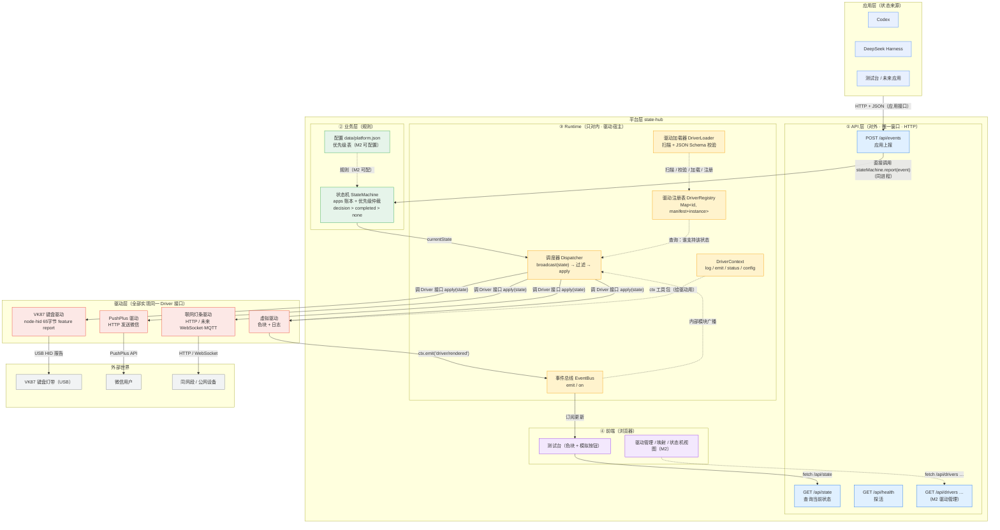

# 最终版架构图（Mermaid）

> 本图是 state-hub 的**最终版架构图**。
> 已包含 2026-09-02 的全部修正：
> - 平台对外只有 **API 层（HTTP）**；
> - **Runtime 只对内（驱动宿主）**，应用不接触；
> - 状态机（业务层）负责**仲裁**；
> - 驱动层实现同一 `Driver` 接口，任意类型（虚拟/USB/网络）。
>
> 复制到支持 Mermaid 的地方即可渲染（VS Code + Mermaid 插件、Typora、mermaid.live 等）。

---

## 读图指南（按箭头走一遍）

1. **应用上报**：Codex/DSH/测试台 → `POST /api/events`（只能走 API 层）。
2. **仲裁**：API 层直接调用 `stateMachine.report(event)` → 状态机更新账本、按优先级 `decision > completed > none` 算 `currentState`。
3. **调度**：`currentState` 交给 Runtime 的调度器 `broadcast(state)` → 查注册表 → 只对"声明支持该状态"的驱动调 `apply(state)`。
4. **驱动执行**：虚拟驱动画色块（`ctx.emit('driver/rendered')` → 事件总线 → 前端）、VK87 写 USB 报告、PushPlus 发微信、联网灯条发 HTTP。
5. **前端**：与 API 层交互（`/api/state`、M2 的 `/api/drivers`）；驱动反馈走事件总线。

## 边界速查（本图正式版）

| 边界 | 契约 | 谁实现 / 谁调用 |
|---|---|---|
| 应用 ↔ 平台 | HTTP API（JSON） | API 层实现；应用调用 |
| 平台内部（API→状态机→Runtime） | 直接函数调用 | 同进程 |
| 平台 ↔ 驱动 | `Driver` 接口 + manifest Schema | 驱动实现；Runtime 调用 |
| 驱动 → 平台（反馈） | `ctx.emit(...)` / 事件总线 | 驱动可选使用 |
> **已废弃：** 本文仅作历史背景，不再具有规范性。请以 `docs/ARCHITECTURE.md` 为准。
